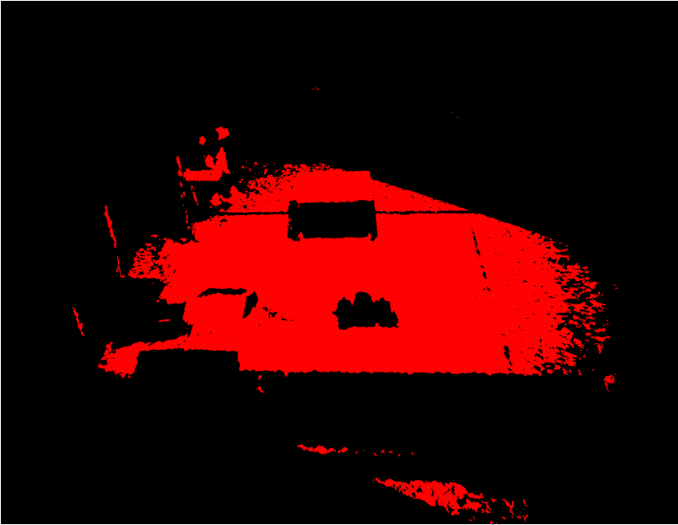
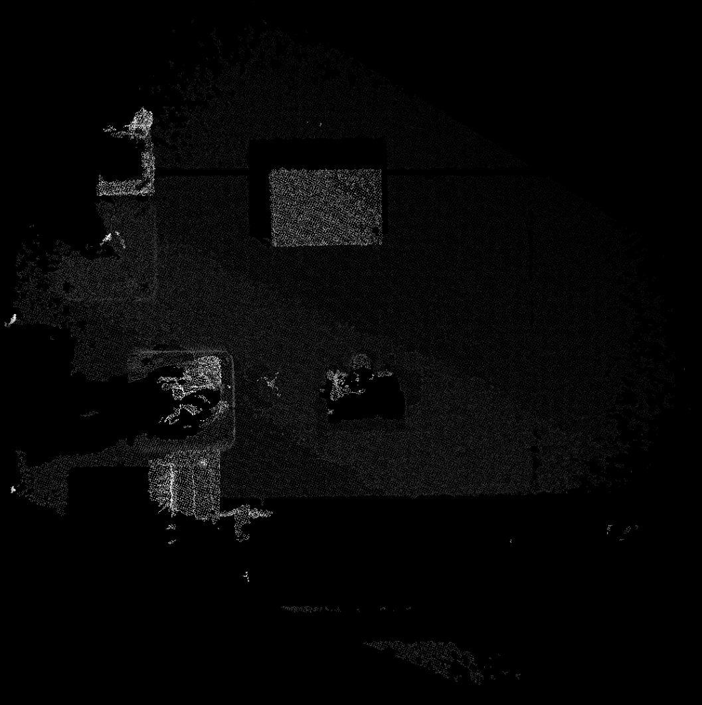

# pcl_fusion

Fuse 2 point clouds aligned to robot frame together.
Produce a depth map of the fused point cloud.
Since the pointclouds are aligned to robot_tf, the fused cloud is upside down. It is corrected during the 
depthmap generation by flipping y coordinates (*-1) inside the pcl.

## timing
Depending on the filtering, the fusion and  generation of depthmap can vary.
With a low filter, voxel leafs of 0.005 :
fuse pcl together : 51ms
generate depthmap : 23ms

With a filter of 0.02 :
fuse pcl : between 3.5ms and 4.09ms
generate depthmap : between 1.75ms and 3.2ms

### Fused pointcloud with a filter (leaf) of 0.02

### Depthmap with filter 0.02

### Depthmap with low filter 0.005

